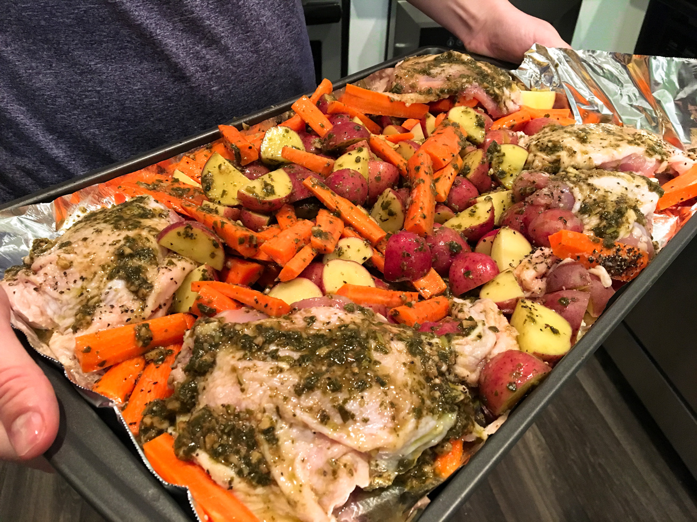

## **Hi everyone!**

I can’t wait to share this recipe with you guys because this is such a delicious, healthy, and EASY dinner (is there some kind of acronym for these words? Because I’m probably going to be saying them a lot on this blog…)! It only took about 15-20 minutes to prep everything! Plus it looks pretty! And double plus, you can impress your friends/family with it -- my husband was very impressed by it! I also ate it with a side of leftover red cabbage (another recipe that I’ll post in the future). The cabbage and chicken & veggies went perfectly together and made it even healthier, as well. Yay!

  

Also, my weekend was fairly boring, so I probably won’t be talking too much about that. What did we even do? I can’t even remember…. Let’s see…I believe we just ate some chilaquiles, went out for Indian food (which was meh), went to the gym, and oh, we drove to Mckinney, TX to visit and see if we’d like to live there (since we heard it’s nice and more affordable). It was very nice. The downtown is super cute, and I love how the houses up there have more land and aren’t right on top of each other, like the houses around here. However, I think it would just be too far for us. :/ It’s not out of the question, but I think we need to look at houses for sale that are closer to Irving (since that’s where the majority of the tech jobs are).

  

Ohhh and today we just watched the season finale of Dirty John! Wow!! Such a good show. We loved it. The ending was crazy…. Has anyone else watched this show yet? It’s definitely the best show I’ve seen for a long time. I need some more TV recommendations, though, because now I have nothing to watch. :(

  

Ok, so since I don’t have anything else to talk about, here’s that recipe:

  

##Baked Pesto Chicken & Veggies

 <strong> Ingredients: </strong>
 <ul>
   <li>Kosher salt and pepper, to taste</li>
   <li>8-11 carrots (I used 9 medium sized carrots), quartered lengthwise</li>
   <li>2 teaspoons balsamic vinegar</li>
   <li>1/2 cup basil pesto sauce (I used this one: <a href="https://www.walmart.com/ip/3-Pack-Prego-Basil-Pesto-Italian-Sauce-8-oz/47233630" target="_blank"> pesto sauce </a> )</li>
   <li>2 lb. bone in, skin on chicken thighs (or legs)</li>
   <li>1 1/2 lbs. baby red potatoes, quartered</li>
   <li>1 Tablespoon olive oil</li>
   <li>3 cloves garlic, minced</li>
   <li>½ tsp crushed red pepper (optional)</li>
</ul>

 

 

## INSTRUCTIONS

1.  Preheat your oven to 400 degrees, and line a large baking sheet with aluminum foil.
    
2.  Spread out the potatoes, carrots, and chicken on the baking sheet and add salt and pepper.
    
3.  In a bowl, stir together the balsamic vinegar, olive oil, pesto, and garlic. Spoon the mixture onto the pan of chicken & veggies and rub the mixture all over the chicken and veggies.
    
4.  Place in the oven and bake for 45-55 minutes, or until vegetables are tender and chicken registers at least 165 degrees.
    
5.  (optional) If the chicken skin isn't super brown or crispy, place the chicken under the broiler for an additional 2-4 minutes to crisp up.

    

  

Enjoy!

  

*Till next time…*

Annah

